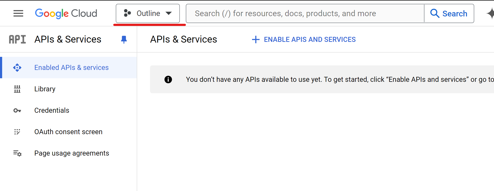
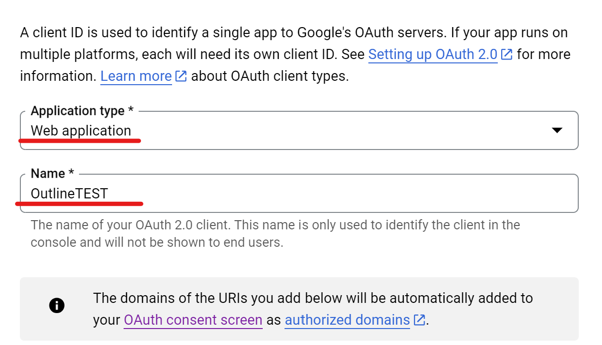
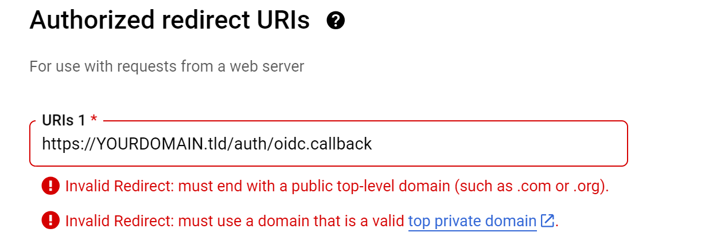
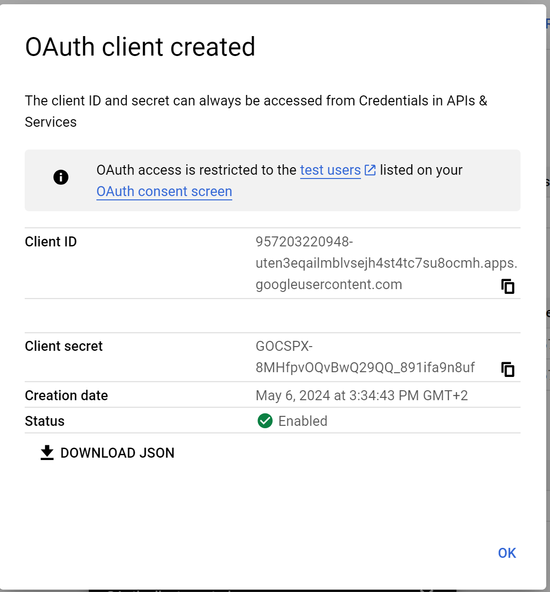

# Google OICD Setup:

1. Go to https://console.developers.google.com/ and login
2. Create a new project and call it whatever you want, we dont need this afterwards

3. Change to that project.

4. Press on OAuth consent screen and create an external OAuth Screen
5. Now fill out those fields with your information (you only have to fill out fields marked with "*")
6. Scopes, we don't need any scopes
7. Test Users, if you want to use google as login provider you can add Whitelist EMails here. Only these will be able to login.
8. At the end just go back to the dashboard.

9. Now go to "Credentials", press "add credentials" and choose OAuth Client ID
![]](image-1.png)

10. 

11. 

Now you have some secrets, like this:

DONT FORGET TO SAVE THEM!

Enter them in the script when prompted.

Good. Now after Outline has started and after you have logged in with google, activate SMTP inside the Outline settings.

And send your first invite to your mail (can be the same Mail as you G-Mail).

Perfect it should work now!

If you see a "network error" go to here https://yourexternalur/auth/oidc.callback
